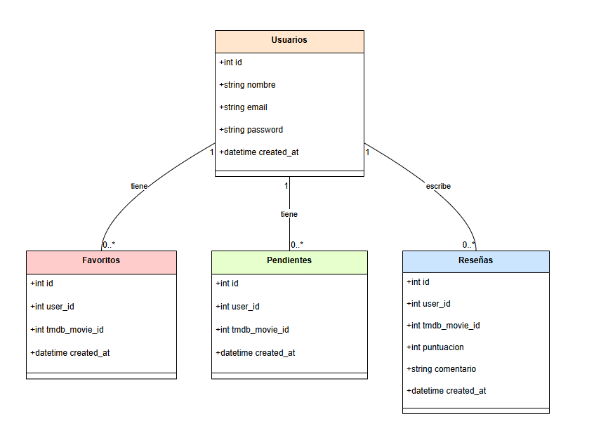

# Spisok Films

Spisok Films es una aplicación web para los amantes del cine. La idea es simple: puedes buscar cualquier película, añadirla a tu lista personal, marcarla como pendiente de ver, dejarle una puntuación y un comentario, y también tiene una sección para pedirle recomendaciones a la IA.

Por dentro, la app consume la API de TMDB para obtener los datos de las películas (póster, sinopsis, puntuación...) y solo guarda en la base de datos lo esencial: qué usuario tiene qué película en su lista y las reseñas personales. El asistente de IA usa la API de Claude (Anthropic) para recomendar películas similares a un título o sugerirte qué ver según tu mood del momento.

---

## Funcionalidad

- **Registro y login** con contraseña encriptada
- **Buscador de películas** en tiempo real via TMDB
- **Ficha de película** con sinopsis, géneros, puntuación TMDB y reparto
- **Mi Lista** — películas que has visto, con tu nota visible en la tarjeta
- **Pendientes de ver** — películas que quieres ver
- **Puntuación y comentario personal** por cada película
- **Asistente IA** (Claude) con dos funciones:
  - *Películas parecidas a...* — recomienda títulos similares en género, estilo y época
  - *¿Qué veo esta noche?* — recomienda según tu mood del momento

---

## Arquitectura

La aplicación sigue el patrón **MVC** con PHP:

```
index.php          → punto de entrada, gestiona las rutas via ?page=
controller/        → lógica de negocio (auth, películas, IA)
model/             → acceso a la base de datos (PDO)
view/              → páginas HTML/PHP
view/js/app.js     → toda la lógica del frontend (fetch, DOM)
view/css/style.css → estilos
config/            → conexión a BD y configuración de API keys
```

**Flujo principal:**
1. El usuario busca una película → JS hace fetch a TMDB → se muestran resultados
2. El usuario añade a favoritos → JS hace POST al backend PHP → PHP guarda `user_id + tmdb_movie_id` en MySQL
3. El usuario entra en "Mi Lista" → PHP consulta MySQL → JS pide los detalles a TMDB → se muestran las tarjetas

---

## Base de datos (ER)



---

## Diagrama UML (clases principales)

```
MovieModel
├── addFavorito()
├── removeFavorito()
├── getFavoritos()
├── isFavorito()
├── addPendiente()
├── removePendiente()
├── getPendientes()
├── addResena()
├── getResena()
└── getAllResenas()

UserModel
├── register()
└── login()

MovieController    → gestiona acciones de películas y reseñas
AuthController     → gestiona login, registro y logout
AIController       → llama a la API de Claude y devuelve recomendaciones
```

---

## Endpoints del backend

Todos los endpoints devuelven JSON.

### AuthController.php

| Acción | Método | Parámetros | Respuesta |
|--------|--------|------------|-----------|
| `login` | POST | `email`, `password` | redirect |
| `register` | POST | `nombre`, `email`, `password` | redirect |
| `logout` | GET | — | redirect |

### MovieController.php

| Acción | Método | Parámetros | Respuesta |
|--------|--------|------------|-----------|
| `add_favorito` | POST | `movie_id` | `{"success": true}` |
| `remove_favorito` | POST | `movie_id` | `{"success": true}` |
| `get_favoritos` | GET | — | `{"movie_ids": [...]}` |
| `is_favorito` | GET | `movie_id` | `{"is_favorito": true}` |
| `add_pendiente` | POST | `movie_id` | `{"success": true}` |
| `remove_pendiente` | POST | `movie_id` | `{"success": true}` |
| `get_pendientes` | GET | — | `{"movie_ids": [...]}` |
| `add_resena` | POST | `movie_id`, `puntuacion`, `comentario` | `{"success": true}` |
| `get_resena` | GET | `movie_id` | `{"resena": {...}}` |
| `get_all_resenas` | GET | — | `{"resenas": [...]}` |

### AIController.php

| Acción | Método | Parámetros | Respuesta |
|--------|--------|------------|-----------|
| `similares` | POST | `titulo` | `{"reply": "..."}` |
| `mood` | POST | `mood` | `{"reply": "..."}` |

---

## Dependencias

**Backend**
- PHP 8+
- MySQL (via phpMyAdmin / XAMPP)
- PDO para las consultas

**Frontend**
- Vanilla JS (sin frameworks)
- Fetch API

**APIs externas**
- [TMDB API](https://www.themoviedb.org/) — datos de películas
- [Anthropic API](https://www.anthropic.com/) (Claude) — asistente IA

---

## Configuración

1. Clona el repositorio en `htdocs/spisok_films`
2. Importa la base de datos en phpMyAdmin
3. Copia `config/appsettings.example.json` → `config/appsettings.json` y añade tus API keys
4. Accede a `localhost/spisok_films`
